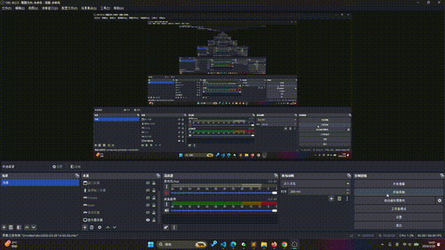
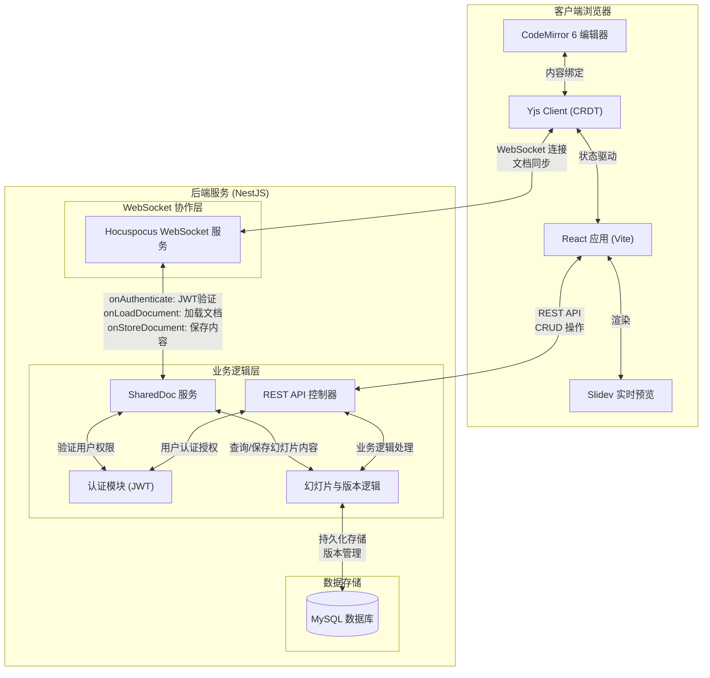

# APPT - AI 驱动的幻灯片协作编辑平台

基于 React + NestJS 构建的现代化幻灯片编辑器，支持实时协作、AI 辅助创作和版本管理。

## ✨ 核心功能

### 简洁工作台
- **简洁工作台**：快速开始，高效创作
- **快捷功能**：集成了常用功能，快速上手

### 🎨 专业幻灯片编辑器
- **CodeMirror 6 驱动**：流畅的 Markdown 编辑体验
- **实时预览**：Dev/Build 双模式即时预览
- 
- **语法高亮**：支持 Markdown、HTML、CSS、JavaScript
- **可单向同步大纲**：点击大纲节点，编辑器与preview窗口同步到对应位置
- **代码片段**：支持插入可复用的代码块、公式、图表等
- 
- **可调整的预览窗口**: 调节各个窗口的大小
- **`Ctrl + v`**: 插入图片
- **快捷键呼出/隐藏**：
  - `Ctrl + K`呼出/隐藏 左侧菜单
  - `Ctrl + alt + K`呼出/隐藏 右侧preview
  - `Ctrl + I ` 呼出/隐藏 AI内联辅助


### 评论功能
- **评论功能**：对幻灯片内容添加评论和讨论
   
### 🗂️ 知识库管理
- **SlideSpace 空间**：按项目或主题组织幻灯片
- **文档结构拖拽**：支持拖拽调整文档顺序
- **层级结构**：支持父子文档树形结构
- **标签分类**：灵活的文档分类系统
- **全局搜索**：快速定位目标文档


### 🤖 AI 智能辅助
- **AI 内容生成**：根据主题自动生成幻灯片内容
- **智能建议**：提供排版和设计建议
- **AI 生图**：集成  AI 图像生成能力


### 👥 实时协作
- **多人在线编辑**：基于 Yjs + Hocuspocus 的 OT 算法
- **实时光标追踪**：查看协作者的编辑位置
- **在线状态显示**：实时展示协作者列表
<video controls src="assets/v1.mp4" title="Title"></video>


### 🔐 权限与安全管理
- **角色权限控制**：Owner / Editor / Commenter / Viewer
- **JWT 认证**：安全的用户身份验证
- **文档可见性**：公开/私有文档灵活控制
- **协作成员管理**：邀请和管理团队成员
  
权限配置
```ts
export const PERMISSIONS: Record<SlideRole, string[]> = {
  owner: ['read', 'comment', 'edit', 'view_history', 'manage', 'delete'],
  editor: ['read', 'comment', 'edit', 'view_history'],
  commenter: ['read', 'comment', 'view_history'],
  viewer: ['read', 'view_history'],
};
```

####  协作架构图



### 📚 版本控制
- **版本历史**：自动保存每次修改记录
- **版本对比**：查看不同版本间的差异
- **一键回滚**：快速恢复到历史版本
- **提交消息**：为重要版本添加说明


## 🛠️ 技术栈

### 前端框架
- **React 19.2.4**：最新 React 版本
- **TypeScript 5.8**：类型安全的开发体验
- **Vite 6.2**：极速开发和构建工具
### 后端框架

- **NestJS 10.2.4**：最新 NestJS 版本

### 核心库
- **React Router v7**：客户端路由管理
- **CodeMirror 6**：强大的代码编辑器
- **Yjs 13.6**：高性能 CRDT 协作库
- **@hocuspocus/provider**：WebSocket 协作提供者

### UI 与工具
- **Lucide React**：现代图标库
- **Axios**：HTTP 请求封装
- **diff**：版本差异对比

## 🖥️ 后端架构 (appt-backend)

### 后端技术栈
- **NestJS 11.0.1**：渐进式 Node.js 框架
- **TypeScript 5.7.3**：类型安全的服务器端开发
- **TypeORM 0.3.28**：ORM 数据库操作
- **MySQL 8.0+**：关系型数据库
- **JWT 认证**：基于 Passport 的认证系统
- **Swagger UI**：API 文档自动生成
- **WebSocket 协作**：基于 Hocuspocus + Yjs 的实时协作服务

### 核心依赖
- **@hocuspocus/server**：WebSocket 协作服务器
- **@nestjs/typeorm**：TypeORM 集成
- **@nestjs/jwt**：JWT 认证模块
- **bcrypt**：密码哈希
- **ali-oss**：阿里云 OSS 存储
- **openai**：OpenAI API 集成

### 模块架构
```
appt-backend/
├── src/
│   ├── ai-assist/              # AI 辅助功能模块
│   ├── auth/                   # 认证授权模块
│   ├── collaborators/          # 协作者管理模块
│   ├── comments/               # 评论系统模块
│   ├── common/                 # 公共工具和守卫
│   │   ├── captcha/            # 验证码服务
│   │   ├── guards/             # 权限守卫
│   │   └── interceptors/       # 拦截器
│   ├── likes/                  # 点赞功能模块
│   ├── registration-codes/     # 注册码管理模块
│   ├── shared-doc/             # 文档协作共享模块
│   ├── slide-spaces/           # 幻灯片空间管理
│   ├── slides/                 # 幻灯片 CRUD 操作
│   ├── snippets/               # 代码片段管理
│   ├── themes/                 # Slidev 主题管理
│   ├── plugins/                # Slidev 插件管理
│   ├── upload/                 # 文件上传模块
│   ├── users/                  # 用户管理模块
│   ├── versions/               # 版本控制模块
│   ├── assets/                 # 静态资源管理
│   └── app.module.ts           # 主模块配置
```

### 数据库设计
后端使用 MySQL 数据库，通过 TypeORM 进行数据持久化。主要实体包括：
- **User**：用户账户、角色和认证信息
- **SlideSpace**：幻灯片空间/知识库
- **Slide**：幻灯片文档内容
- **SlideVersion**：幻灯片版本历史
- **SlideUserRole**：用户-幻灯片权限关联
- **SlideComment**：幻灯片评论和讨论
- **Snippet**：可复用代码片段
- **RegistrationCode**：用户注册码管理

### API 设计
采用 RESTful API 设计原则，主要接口分组：
- **认证接口** (`/api/auth/*`)：登录、注册、令牌刷新
- **用户管理** (`/api/users/*`)：用户信息、密码重置
- **空间管理** (`/api/slide-spaces/*`)：知识库 CRUD、成员管理
- **幻灯片操作** (`/api/slides/*`)：幻灯片内容、权限、协作
- **版本控制** (`/api/versions/*`)：版本历史、回滚、对比
- **评论系统** (`/api/comments/*`)：评论 CRUD、树形结构
- **AI 辅助** (`/api/ai/*`)：内容生成、图像生成、智能建议
- **文件上传** (`/api/upload/*`)：图片、资源上传到 OSS

### 安全与权限
- **JWT 认证**：所有 API 请求需要有效的 JWT 令牌
- **角色权限系统**：Owner/Editor/Commenter/Viewer 四级权限
- **全局守卫**：JwtAuthGuard 和 SlideRoleGuard 保护路由
- **数据验证**：使用 class-validator 进行请求参数验证
- **密码加密**：bcrypt 存储哈希密码

### 实时协作架构
```
前端 (React + Yjs) ←WebSocket→ Hocuspocus 服务器 ←REST API→ NestJS 业务层
      ↓                              ↓                          ↓
  编辑器状态                   文档状态同步                数据持久化存储
```
- **Hocuspocus 服务器**：处理 Yjs 文档的 WebSocket 连接和状态同步
- **NestJS 协作模块**：处理协作相关的业务逻辑和权限验证
- **自动保存**：协作内容定期同步到数据库

### 部署配置
- **环境变量**：通过 `.env` 文件配置数据库、JWT 密钥、OSS 等
- **生产构建**：`pnpm run build` 生成 `dist/` 目录
- **进程管理**：推荐使用 PM2 或 Docker 容器化部署
- **反向代理**：Nginx 配置 WebSocket 升级和静态资源服务

## 📦 项目结构

```
appt-front/
├── api/                    # API 接口封装层
│   ├── ai.ts              # AI 功能接口
│   ├── comment.ts         # 评论接口
│   ├── slide.ts           # 幻灯片接口
│   ├── space.ts           # 空间管理接口
│   ├── snippet.ts         # 代码片段接口
│   ├── version.ts         # 版本管理接口
│   ├── upload.ts          # 文件上传接口
│   └── user.ts            # 用户认证接口
├── components/             # 可复用组件
│   ├── Auth/              # 认证相关组件
│   │   └── AuthModal.tsx  # 登录注册模态框
│   ├── Common/            # 通用组件
│   │   ├── Modal.tsx      # 模态框组件
│   │   └── Toast.tsx      # 提示消息组件
│   ├── Editor/            # 编辑器相关组件
│   │   ├── ResizablePanels.tsx
│   │   └── CollaboratorModal.tsx
│   ├── Layout/            # 布局组件
│   │   └── DashboardLayout.tsx
│   └── SpaceTree/         # 空间树组件
│       └── FileTree.tsx
├── constant/               # 常量定义
│   └── permissions.ts     # 权限配置
├── pages/                  # 页面级组件
│   ├── Dashboard/         # 仪表板页面
│   │   ├── Start.tsx      # 起始页（工作台）
│   │   └── Explore.tsx    # 探索发现页
│   ├── Editor/            # 编辑器页面
│   │   ├── EditorPage.tsx # 主编辑器
│   │   ├── useSlideParser.ts
│   │   └── components/    # 编辑器子组件
│   │       ├── EditorHeader.tsx
│   │       ├── EditorSidebar.tsx
│   │       └── EditorPreview.tsx
│   ├── Presentation/      # 演示页面
│   │   └── PresentationPage.tsx
│   ├── Settings/          # 设置页面
│   │   └── SettingsPage.tsx
│   └── Space/             # 空间管理页面
│       ├── SpaceDetail.tsx
│       └── SpaceSettings.tsx
├── utils/                  # 工具函数
├── types.ts                # TypeScript 类型定义
├── App.tsx                 # 应用入口组件
├── index.tsx               # 渲染入口
└── vite.config.ts          # Vite 配置文件
```
## 数据库设计

### ER 图


### 表说明

#### 核心表
- **users**: 用户信息表，存储用户账户、角色和注册码信息
- **slide_spaces**: 幻灯片空间表，组织和管理幻灯片集合
- **slides**: 幻灯片内容表，存储具体的幻灯片文档
- **slide_versions**: 版本控制表，记录幻灯片的版本历史

#### 协作与权限表
- **slide_user_roles**: 幻灯片用户角色表，定义用户在幻灯片中的权限
- **slide_comments**: 评论表，支持对幻灯片的评论和回复
- **likes_slide**: 幻灯片点赞表
- **likes_space**: 空间点赞表

#### 资源与配置表
- **snippets**: 代码片段表，用户可复用的代码块
- **registration_codes**: 注册码表，用于用户注册管理
- **slidev_themes**: Slidev 主题表
- **slidev_plugins**: Slidev 插件表

## 🚀 快速开始

### 前置要求

- **Node.js**: >= 18.x
- **包管理器**: npm / pnpm / yarn
- **ALIYUN API Key**: （可选）用于 AI 功能

### 安装步骤

1. **克隆项目**
   ```bash
   git clone <repository-url>
   cd appt-front
   ```

2. **安装依赖**
   ```bash
   npm install
   # 或使用 pnpm
   pnpm install
   ```

3. **配置环境变量**
   
   创建 `.env.local` 文件并配置：
   ```env
   DASHSCOPE_API_KEY=xxx
   QWEN_MODEL=qwen-plus
   QWEN_IMAGE_MODEL=    qwen-image-plus
   ```

4. **启动开发服务器**
   ```bash
   npm run dev
   ```
   
   访问 `http://localhost:5173` 查看应用

### 生产构建

```bash
# 构建生产版本
npm run build

# 预览构建结果
npm run preview
```

## 📖 使用指南

### 创建幻灯片

1. 点击 "Create Slide" 按钮
2. 选择知识库（SlideSpace）
3. 输入幻灯片标题
4. 开始编辑内容

### 编辑幻灯片

- **Markdown 语法**：使用标准 Markdown 编写内容
- **分隔符**：使用 `---` 分隔不同幻灯片页面
- **代码高亮**：支持多种编程语言语法高亮
- **实时预览**：右侧面板实时显示效果

### 协作功能

1. **邀请成员**：在设置中添加协作者邮箱
2. **设置权限**：选择合适的角色权限
3. **实时编辑**：多人同时编辑同一文档
4. **评论互动**：对特定内容添加评论

### AI 功能使用

1. 打开 AI 面板（侧边栏）
2. 输入你的需求（如："创建一个关于 React Hooks 的幻灯片"）
3. AI 将自动生成内容
4. 审核并插入到编辑器

### 版本管理

- **手动保存**：Ctrl+S 保存当前内容
- **创建版本**：Ctrl+Shift+S 保存并创建新版本
- **查看历史**：在 Git 面板中查看所有版本
- **版本回滚**：点击回滚按钮恢复历史版本

## 🔌 API 集成

### 后端服务配置

在 `.env.local` 中配置后端 API 地址：

```env
VITE_API_BASE_URL=http://localhost:3000
```

### 主要 API 模块

| 模块 | 功能描述 |
|------|----------|
| `slideApi` | 幻灯片 CRUD、内容保存、权限管理 |
| `spaceApi` | 知识库空间创建、查询、成员管理 |
| `versionApi` | 版本历史查询、版本创建、回滚 |
| `commentApi` | 评论增删改查、评论树展示 |
| `snippetApi` | 代码片段管理、插入编辑器 |
| `uploadApi` | 图片上传、资源管理 |
| `userApi` | 用户认证、信息获取 |
| `aiApi` | AI 内容生成、智能建议 |


## 📄 许可证

MIT License

## 🔗 相关链接

- [AI Studio 项目页面](https://ai.studio/apps/3b667a16-78a6-4ef2-84c4-3aaa19f0f667)
- [React 官方文档](https://react.dev/)
- [CodeMirror 文档](https://codemirror.net/)
- [Yjs 协作库](https://docs.yjs.dev/)

---

<div align="center">
  <strong>🚀 开始你的幻灯片创作之旅！</strong>
</div>